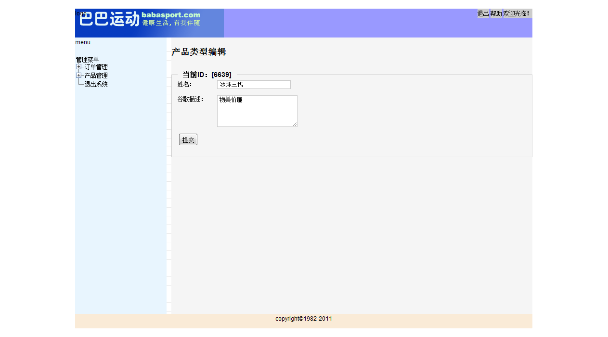
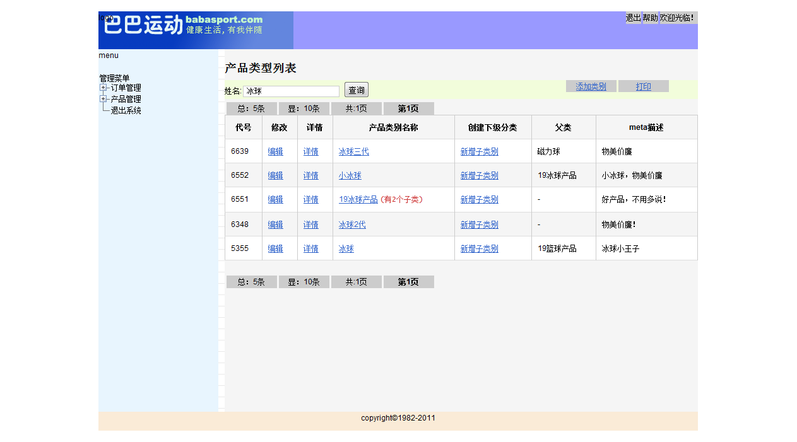
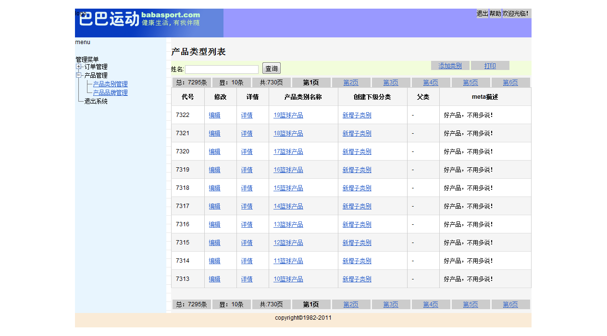
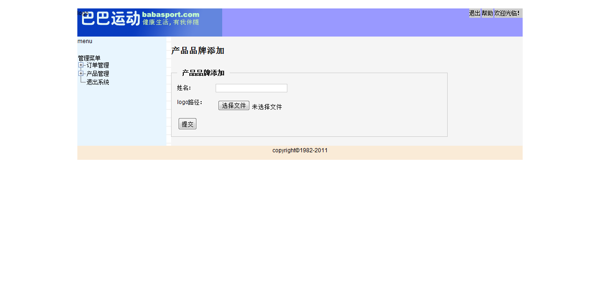

#代码清单：

+ 大部分是2010 ~  2013部分Java学习写的小练习：
+ 部分是实际投入项目中使用的代码，部分代码河蟹后，整理提交git分享备份：

## 目录简单说明
+ babasportrefactoring：用Spirng JPA边学习边重构ITCast的巴巴运动网教程；
+ emos：当年为解决系统维护过程中，巨量数据变更的流转电子化，做出的尝试。未完成。后引进redmine二次开发后解决
+ monitorsms：这个是离开上一个项目时，交接期间做出来的根据模版调用短信接口预警的独立预警模块；
+ retailbreakpersonal：
    + 这个是当年运维待的时间长了，主动请缨做了一个报文批量发送的模块。主要功能也是根据模版和采集过来的数据组装报文。开发团队觉得繁琐，加上工期紧，没有人愿意接手，我忍不住出手写了一个。实际线上使用效果非常好。
    + 挑战：因为要考虑到发布，并且不能和开发团队主项目的jar包冲突。所以得独立发布一个jar包，供开发工程师调用。尽可能不使用第三方jar包，即使使用了，最终也要发布打包成一个jar包。幸好netbeans自身支持，通过 maven-shade-plugin也支持这种打包功能。
+ document：备份能发布的文档

## 关于编译

标准maven工程，参考maven使用即可；

## 巴巴运动网学习项目截图

+ baba_产品类型编辑
+ baba_产品类型查询
+ baba_产品类型列表
+ baba_产品品牌添加
+ 在oschina分享的代码和讨论 https://www.oschina.net/code/snippet_104958_6526

